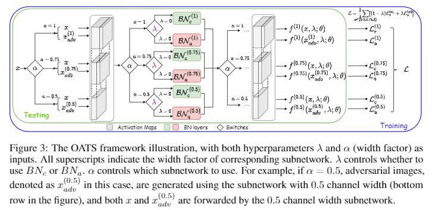

# Once-for-All Adversarial Training: In-Situ Tradeoff between Robustness and Accuracy for Free

[](https://opensource.org/licenses/MIT)

Haotao Wang\*, Tianlong Chen\*, Shupeng Gui, Ting-Kuei Hu, Ji Liu, Zhangyang Wang

In NeurIPS 2020

## Overview
We present a novel once-for-all adverarial training (OAT) framework that addresses a new and important goal: in-situ “free” trade-off between robustness and accuracy at testing time. In particular, we demonstrate the importance of separating standard and adversarial feature statistics, when trying to pack their learning in one model.

We also extend from OAT to OATS, that enables a joint in-situ trade-off among robustness, accuracy, and the computational budget.

Experimental results show that OAT/OATS achieve similar or even superior performance, when compared to traditional dedicatedly trained robust models. Our approaches meanwhile cost only one model and no re-training. In other words, they are **free but no worse**.

## Framework
<p align="center">
</br>
</p>


## Training
### Our once-for-all adversarial training method (OAT):
```
python OAT.py --ds <dataset> -b <batch_size> -e <epochs> --lr <learning_rate> --use2BN
```

### Traditional dedicated adversarial training baseline method (PGDAT):
```
python PGDAT.py --ds <dataset> -b <batch_size> -e <epochs> --lr <learning_rate>
```

## Citation
If you use this code for your research, please cite our paper.
```
@inproceedings{wang2020onceforall,
  title={Once-for-All Adversarial Training: In-Situ Tradeoff between Robustness and Accuracy for Free},
  author={Wang, Haotao and Chen, Tianlong and Gui, Shupeng and Hu, Ting-Kuei and Liu, Ji and Wang, Zhangyang},
  booktitle={NeurIPS},
  year={2020}
}
```

